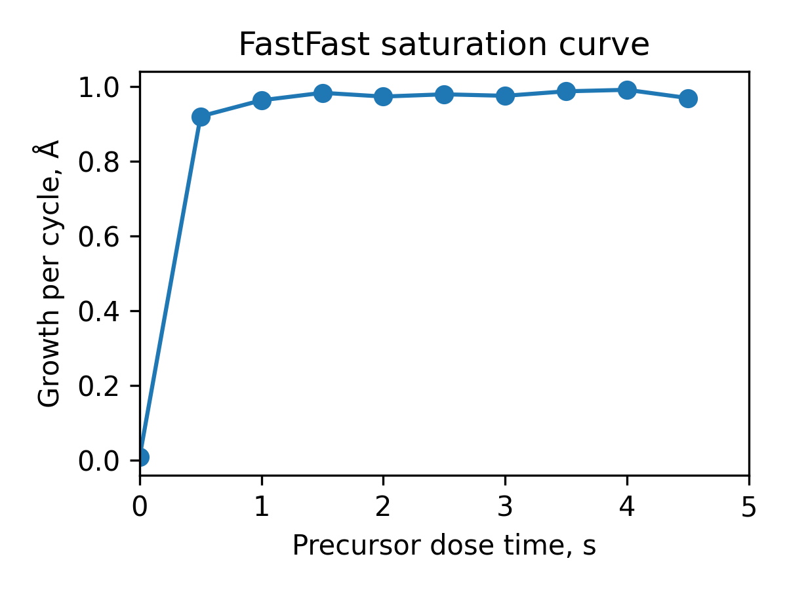
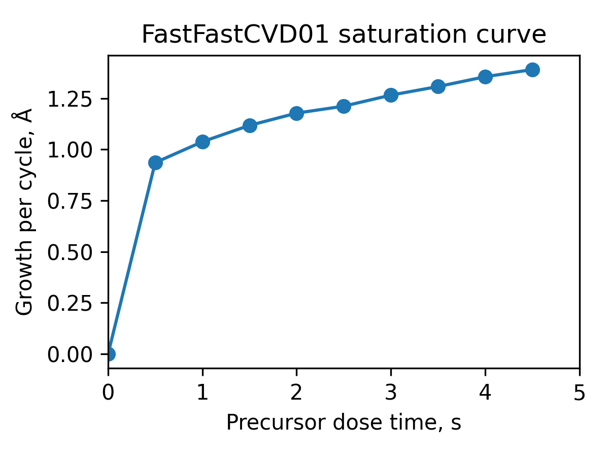
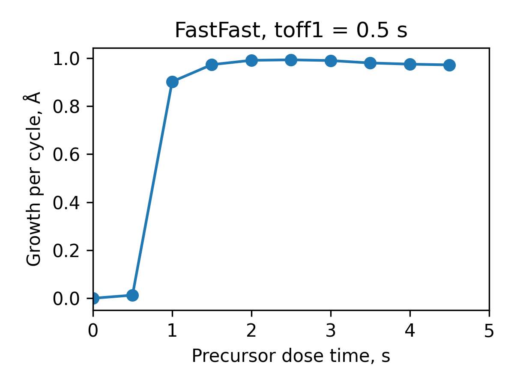

# A brief tutorial

## Installation

To install `aldenv` use:

```
pip install aldenv
```

## Use

`aldenv` implements a number of environments that can be used to benchmark optimization algorithms.

For instance:

```Python
from aldenv.envs.steadystate import FastFast

ald = FastFast(round_to=3, noise=0.01)
```

creates a fast-fast ALD process where both the precursor and co-reactant are saturated after 0.2s doses and with a saturation growth per cycle of 1 Angstrom. It considers a noise level of 0.01 Angstrom and that the output is limited to three significant digits.

Sweeping the precursor dose time gives the following saturation curve:

<figure markdown="span">
{ width="60%" }
</figure>

## steadystate environments

`steadystate` environments contain a series of virtual ALD processes where the growth per cycle is computed as a function of the precursor and the co-reactant dose times.
For instance, in our work [Performance of AI agents based on reasoning language models on ALD process optimization tasks](https://doi.org/10.1116/6.0005313), we use the following environments included in `steadystate` to evaluate the ability of agents based on reasoning LLMs to optimize ALD processes:

- `FastFast` represents an ideal ALD process with fast saturation for both precursor and co-reactant.
- `SlowFast` represents an ideal ALD process where the precursor requires longer doses to saturate.
- `SlowSlow` represents an ideal ALD process where the precursor and the coreactant are slow to saturate.
- `SoftFast` introduces a soft-saturating precursor, where after a fast rise it slowly saturates.
- `FastFast3` is a version of FastFast where the saturated growth per cycle is 0.3 Angstrom.

In addition to these environments, which are fully self-limited, `aldenv` also contains
environments where the growth has a CVD component. For instance:

- `FastFastCVD01` has a built in CVD component of 0.1 Angstrom per second. This means that a 10 second dose give you an additional Angstrom due to the non self-limited behavior.

This results in the following saturation curve:

<figure markdown="span">
{ width="60%" }
</figure>

### Upstream consumption

All `steadystate` environments derive from `ALDProcess`, which wraps an ALD model and applies experimental limitations on top of its raw output. 

In order to model upstream consumption,
`ALDProcess` and all its subclasses can
receive two parameters, `toff1` and `toff2`, to create offsets. The corresponding saturation curves are computed at the effective dose times `t1 - toff1` and `t2 - toff2`. A dose shorter than its offset is fully consumed upstream: nothing reaches the sample and the growth per cycle is 0. The defaults are `toff1 = toff2 = 0`, in which case there is no upstream consumption and the dose times are passed through unchanged.

For example, giving `FastFast` a precursor offset of 0.5 s:

```Python
from aldenv.envs.steadystate import FastFast
import matplotlib.pyplot as pt
import numpy as np

process = FastFast(round_to=3, noise=0.01, toff1=0.5)

t1 = np.arange(0, 5, 0.5)
t2 = 1.0

gpc = np.array([process(t, t2) for t in t1])

pt.figure(figsize=(4,3))
pt.plot(t1, gpc, 'o', linestyle="-")
pt.xlabel("Precursor dose time, s")
pt.ylabel(r"Growth per cycle, $\mathrm{\AA}$")
pt.title("FastFast, toff1 = 0.5 s")
pt.xlim(0, 5)
pt.tight_layout()
pt.savefig("fastfast_toff_sat.png", dpi=300)
pt.show()
```

produces the saturation curve below:

<figure markdown="span">
{ width="60%" }
</figure>

Compared with the offset-free curve at the top of this tutorial, the whole saturation curve is displaced by 0.5 s: doses of 0.5 s or shorter give no growth at all, and saturation is only reached after about 0.7 s instead of about 0.2 s. The saturated growth per cycle is unchanged.

 