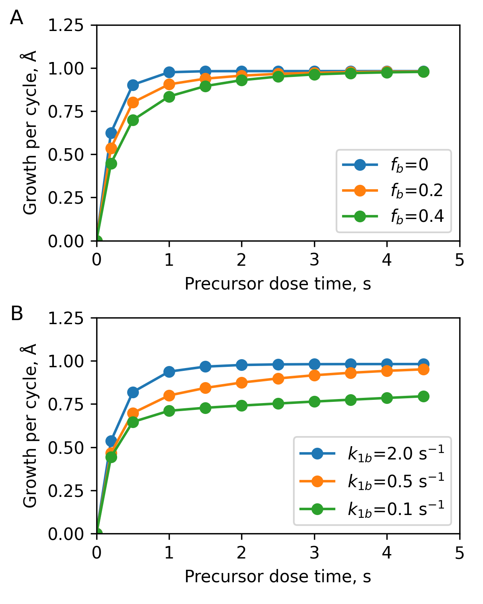
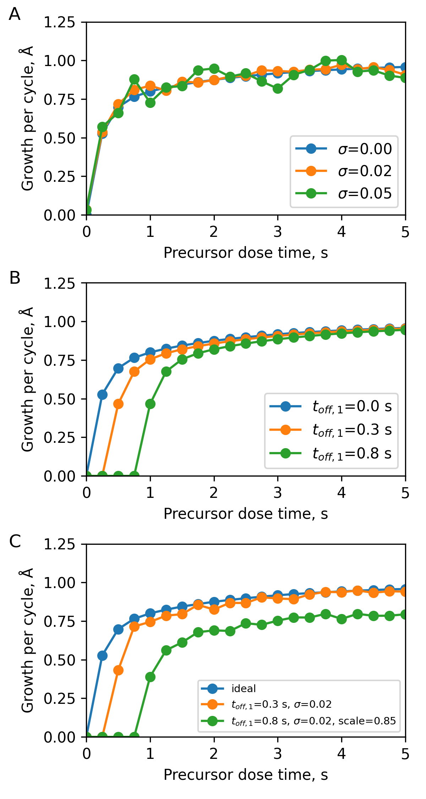

# A brief tutorial

## Installation

To install `aldenv` use:

```
pip install aldenv
```

## ALD models

`aldenv` implements a series of surface kinetic models based on irreversible first order Langmuir kinetics. The four models currently implemented are:

- `SingleALD`: ALD model with a single reaction pathway
- `MultiALD`: ALD model with multiple reaction pathways
- `SoftSatALD`: a specific case of `MultiALD` where the precursor has a second reaction pathway, so that it is soft-saturating.
- `SingleALDCVD`: ALD model with an additional CVD component characterized by the presence of a non-zero co-reactant partial pressure during the precursor dose.

All these models compute the steady state growth per cycle for a pair of dose and a precursor dose times, assuming that these are ideally separated by purge times.

For instance, we can import and define a `SoftSatALD` process as follows:

```python
from aldenv.models import SoftSatALD
ald = SoftSatALD(k1=5, k1b=1, fb=0.2, k2=4, gpc=1)
```

Here, the `k` inputs represent the rate constants (in s<sup>-1</sup>) and `fb` is the fraction of the surface sites with the rate constant `k1b`. The indices `1` and `2` represent the precursor and a coreactant.

The expression:
```python
g = ald(1.0,1.0)
```
computes the steady state growth per cycle for an ALD process with a dose and precursor dose times of 1 second.

Here is a plot generated using `SoftSatALD` showing saturation curves for different parameter values:

<figure markdown="span">
{ width="60%" }
</figure>

## ALD process

The difference between an ALD model and an ALD process, is that an ALD process incorporates some of the non-idealities that you would expect in an experimental system. These are mainly three:

- Measurement noise, added to a model's output
- Dose offsets due to upstream consumption
- Scaling factors coming from the nature of the measurement carried out to determine the growth per cycle.

The way `aldenv` implements this is through the use of the `ALDProcess` class. For instance,
taking the `SoftSatALD` model considered above, we can implement a process as follows:

```Python
from aldenv.models import SoftSatALD
ald = SoftSatALD(5, 0.5, 0.3, 4, gpc=1)

process = ALDProcess(ald, round_to=3, toff1=0.8, noise=0.02, scale=0.85)
```

This implement an ALD process where the output is rounded to three significant digits, has an upstream consumption for the precursor equal to 0.8 seconds, adds a noise of 0.02, and introduces a scaling factor for the growth per cycle of 0.85.

<figure markdown="span">
{ width="60%" }
</figure>

## Environments

Finally, `aldenv` implements a number of environments that can be used to benchmark optimization algorithms. These are meant to represent a set of generic ALD processes.

For instance:

```Python
from aldenv.envs.steadystate import FastFast

ald = FastFast(round_to=3, noise=0.01)
```

creates a fast-fast ALD process where both the precursor and co-reactant are saturated after 0.2s doses and with a saturation growth per cycle of 1 Angstrom. It considers a noise level of 0.01 Angstrom and that the output is limited to three significant digits.

Sweeping the precursor dose time gives the following saturation curve:

<figure markdown="span">
{ width="60%" }
</figure>

## steadystate environments

`steadystate` environments contain a series of virtual ALD processes where the growth per cycle is computed as a function of the precursor and the co-reactant dose times.
For instance, in our work [Performance of AI agents based on reasoning language models on ALD process optimization tasks](https://doi.org/10.1116/6.0005313), we use the following environments included in `steadystate` to evaluate the ability of agents based on reasoning LLMs to optimize ALD processes:

- `FastFast` represents an ideal ALD process with fast saturation for both precursor and co-reactant.
- `SlowFast` represents an ideal ALD process where the precursor requires longer doses to saturate.
- `SlowSlow` represents an ideal ALD process where the precursor and the coreactant are slow to saturate.
- `SoftFast` introduces a soft-saturating precursor, where after a fast rise it slowly saturates.
- `FastFast3` is a version of FastFast where the saturated growth per cycle is 0.3 Angstrom.

In addition to these environments, which are fully self-limited, `aldenv` also contains
environments where the growth has a CVD component. For instance:

- `FastFastCVD01` has a built in CVD component of 0.1 Angstrom per second. This means that a 10 second dose give you an additional Angstrom due to the non self-limited behavior.

This results in the following saturation curve:

<figure markdown="span">
{ width="60%" }
</figure>

### Upstream consumption

All `steadystate` environments derive from `ALDProcess`, which wraps an ALD model and applies experimental limitations on top of its raw output. 

In order to model upstream consumption,
`ALDProcess` and all its subclasses can
receive two parameters, `toff1` and `toff2`, to create offsets. The corresponding saturation curves are computed at the effective dose times `t1 - toff1` and `t2 - toff2`. A dose shorter than its offset is fully consumed upstream: nothing reaches the sample and the growth per cycle is 0. The defaults are `toff1 = toff2 = 0`, in which case there is no upstream consumption and the dose times are passed through unchanged.

For example, giving `FastFast` a precursor offset of 0.5 s:

```Python
from aldenv.envs.steadystate import FastFast
import matplotlib.pyplot as pt
import numpy as np

process = FastFast(round_to=3, noise=0.01, toff1=0.5)

t1 = np.arange(0, 5, 0.5)
t2 = 1.0

gpc = np.array([process(t, t2) for t in t1])

pt.figure(figsize=(4,3))
pt.plot(t1, gpc, 'o', linestyle="-")
pt.xlabel("Precursor dose time, s")
pt.ylabel(r"Growth per cycle, $\mathrm{\AA}$")
pt.title("FastFast, toff1 = 0.5 s")
pt.xlim(0, 5)
pt.tight_layout()
pt.savefig("fastfast_toff_sat.png", dpi=300)
pt.show()
```

produces the saturation curve below:

<figure markdown="span">
{ width="60%" }
</figure>

Compared with the offset-free curve at the top of this tutorial, the whole saturation curve is displaced by 0.5 s: doses of 0.5 s or shorter give no growth at all, and saturation is only reached after about 0.7 s instead of about 0.2 s. The saturated growth per cycle is unchanged.

 